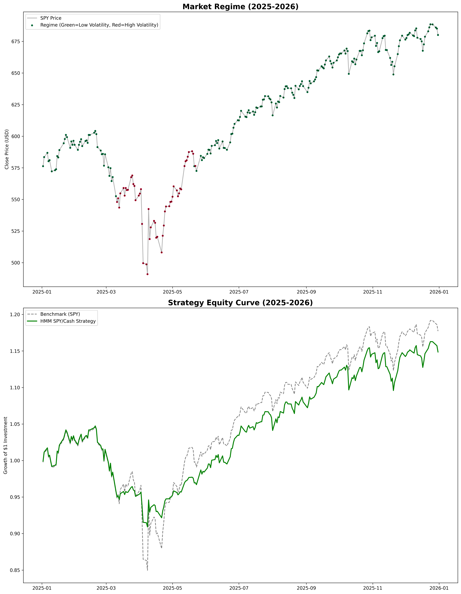

# Tactical Asset Allocation & Risk Mitigation Strategy Using HMM

This project implements a **Gaussian Hidden Markov Model (HMM)** to identify latent market regimes—specifically "Low Volatility" and "High Volatility" states. By detecting these shifts, the strategy tactically rotates between Equities (SPY) and cash to optimize risk-adjusted returns.

## Performance Analysis
The HMM was trained on data from 2010-01-01 to 2024-12-31. The strategy was backtested using data from 2025-01-01 to 2026-01-01. The results demonstrate a significant improvement in portfolio efficiency through regime-based switching.

| Metric | Benchmark (SPY) | Tactical Strategy | Relative Improvement |
| :--- | :--- | :--- | :--- |
| **Annual Return** | 17.87% | 14.98% |-2.89% absolute|
| **Annual Vol** | 19.33% | **12.63%** | **-34.66%** |
| **Sharpe Ratio** | 0.85 | **1.11** | **+30.58%** |
| **Max Drawdown** | -18.76% | **-13.21%** | **-29.58%** |
| **CVaR (95%)** | -2.76% | **-1.90%** | **-31.15%** |

 

### **Key Results**
* **Risk-Adjusted Return Trade-off:** The strategy outperformed the benchmark during the high volatility region of the backtesting period. While the terminal annual return trailed the benchmark by 2.89% on an absolute basis, this trade off resulted in a reduction of the risk exposure as shown by the metrics below.
* **Increase in Sharpe Ratio:** The strategy delivered a Sharpe Ratio of 1.11 representing a 30.58% improvement over the benchmark. This was achieved by mitigating equity exposure during high-volatility periods by switching from SPY to cash.
* **Tail Risk Mitigation:** The Conditional Value at Risk (CVaR) improved by 31.15%, proving the HMM's ability to exit the market before the left-tail events materialized.
